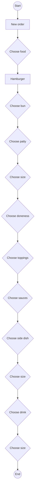

## Hamburger API documentation

## Order process overview

## Overview

### GET- retrieve the bill
### POST- submit the order

Table exmaple from the good docs:

The {product} APIs use the following standard HTTP response codes:

| Status code | Message           | Description   |
|-------------|-------------------|---------------|
| `200 OK`    | Request succeeds. | {description} |
|             |                   |               |
|             |                   |               |
